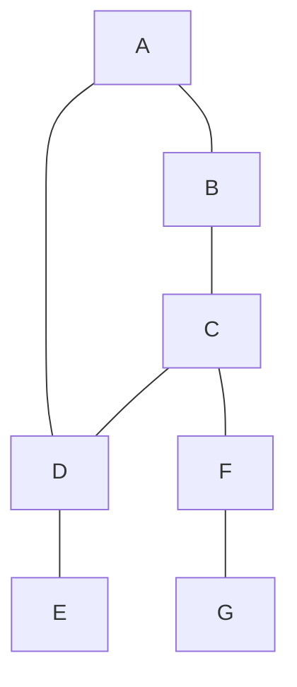

Previously I wrote about [my principles for \#dungeon23](/2022/12/14/megadungeon23-planning.html) and the distractions and pitfalls I'm hoping to avoid. I'm going to refer to these in this post, so here's a quick recap:

**Principles**
- (P1) Have a structure.
- (P2) Keep it portable.
- (P3) Keep it simple.
- (P4) Minimize distractions; automate what's necessary and skip the rest.

**Distractions**
- (D1) Mapping
- (D2) (Uninteresting) treasure
- (D3) Stats and numbers

In this post I'm going to talk about some of the tools and practices I'm adopting to support these.

## Notetaking in Obsidian
In keeping with (P2) and (P3), it's important to that whatever tools I use to write my dungeon be be easy to use and easy access at any time. For me that, that means my dungeon needs to live on my phone. While I am a sucker for nice stationary, I am also forgetful with objects and prone to misplacing things, and have to spend nights away from home fairly often. It also needs to be simple enough I don't get caught up playing around with features or get lost looking for fancy solutions to simple problems.

Obsidian is a markdown-based note-taking tool that I already use a _lot_. I'm using it to write this post, and my app is configured to dump Obsidian notes directly into this blog! Markdown means it's easy to do basic text formatting without breaking out of the typing interface (P3, P4). Also, my Obsidian library lives as a set of markdown files in my Dropbox, which means I can access it from anywhere and edit it in virtually any text editor, if the need arises (P2). 

Obsidian is going to be doing a lot of work for me, and you'll be hearing about it more. But for now...

## Statistically Average Dungeon, With Tweaks
I sweat numbers (D3). I like numbers. I am a person who fixates on numbers. I am not going to magically stop being that person. So part of my structure (P1) is going to pre-sweat the numbers.

As Sean suggests, I am going to make each week a thematic cluster of 7 rooms. 6 of those rooms will adhere to the model of [Marcia's Bite-Sized Dungeon](https://traversefantasy.blogspot.com/2022/11/bite-sized-dungeons.html). The 7th will be left a wildcard to drive home the theme. I give myself permission to stray from Marcia's model, but as a checklist to guide my writing (P1) and contain my fussing (D3).

## Leave Fussy Details for Later
I talked in my last post about how a lot of treasure is functionally a fancy wrapping for XP. I don't think this is necessarily a bad thing, but it is a high-bandwidth, low value way to spend my writing time (P4, D2). I do not enjoy enumerating the gems and jewels in the coin pile, and I don't want to encumber myself with a whole system to do it for me, as dealing with it also takes away from writing (P3).

But here's the thing -- for the purpose of coming up with a dungeon, _those details don't matter_. Obviously interest treasure is better than boring treasure, but boring treasure is better than no treasure because you stopped writing your dungeon. Its precise value matters when, and _if_, a party actually explores it. So I'm just going to mark any treasure piles or valuables with a "(T)". Maybe some days I'll just write "pile of treasures (T)". Later, during an editing pass or in preparation to actually _run_ the dungeon, I'll scan the document for (T)s and replace them with more detailed descriptions and amounts adjusted to whatever criteria I'm obsessing over that week. The same, incidentally, can be done for monster stats (D3).

More broadly, I am keeping in mind that the point of this exercise isn't to make a *good* dungeon, or a *publishable* dungeon, or a dungeon that's made to be used by anyone besides me. There are a lot things I might feel compelled to do that aren't actually conducive to the challenge (D4). In fact, I still haven't decided if and how I'm going to share my work as I progress -- but I do know that that, too, is secondary to actually doing it. It can happen if I please and am able, but it must not interfere with just getting my ideas down or make that process more cumbersome (P3).

## Mermaid Maps
For every week, I'm going to use Marcia's 10 configurations of 6-node maps, with an extra room to tack on and link as it pleases me.

Getting maps into my system and modifying them is probably the trickiest part of this whole endeavor. Marcia's model saves me the trouble of coming out with layouts, but it doesn't give me a great way to actually visualize the layouts I'm using.

But hey, remember when I said Obsidian is going to do a lot of heavy lifting?

It turns out Obsidian supports a little language called Mermaid that uses simple notation to generate flowcharts and graphs. And it does it all _directly in the editor._ Here's an example of a chunk of Mermaid code in Obsidian:

```


That renders like this:


I'm not going to get into it all here, but Mermaid can do some fairly sophisticated stuff. I can put simpler keys directly on the map. The renderer also arranges the graph to minimize crossed lines. That means I don't have to worry about screwing up my whole dungeon when I decide to change around a few connections -- mermaid will move the nodes as necessary so they read well and make sense.

As a proof of concept, I already mapped out the first 3 weeks of January. They look like this:


That's a great big (D1) for you right there.

So that's my system! Hope this is helpful to someone. Or at least kind of interesting?

I don't know how to end this post! Did you like it?? Ok bye!!!