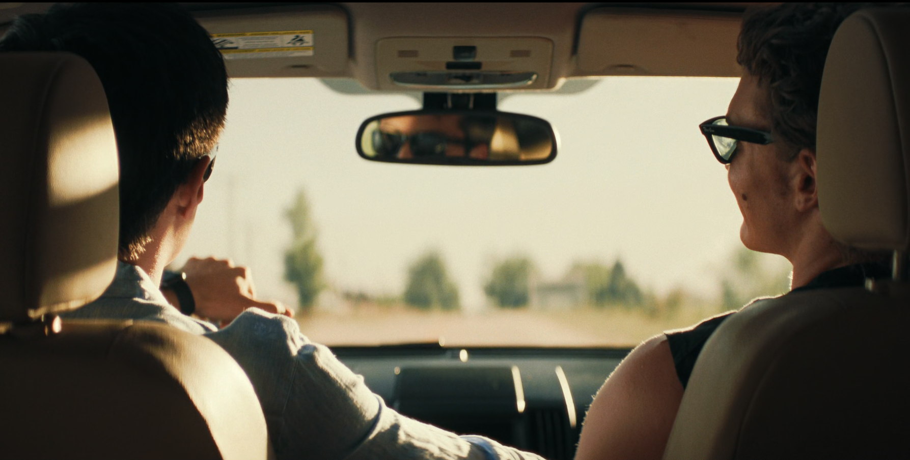

This is not a post about the things this blog is usually about. This is a post where I write at length about how a TV show about gay hockey players hit me like a fucking truck, and I'm posting it here because I want to get these thoughts in writing and share them and I don't have anywhere else do that.

So I literally don't know if I mentioned this in the 10+ years I've been writing this blog but I'm gay. If I haven't mentioned it it's not really a closet thing so much as like, not usually what I'm writing about here. That's an important context note here. Equally important is I am married to another man.

My husband watched *Heated Rivalry*, the aforementioned show about gay hockey players. I would catch bits of it while doing other things but did not sit down and watch it. There are two main reasons for this:

1. Don't care for hockey.
2. I really really really really REALLY don't trust big media companies telling stories about gay men.

This second point is not like, an ideological one. It is a learned aversion from years of bad experiences. Try to count roughly how many movies and/or TV shows you've seen that have a gay man. Now try to work out the percentage of those in which he does not wind up alone and/or dead, usually in tragic fashion. My first gay movie was *Brokeback Mountain*, guess how that one goes. Do you remember when fucking *Tron Legacy* iced a gay? I do.

For most of my life, the only gay love stories I had were the ones I was part of. If you don't get how painful and lonely that can be, I'm not sure I can explain it. I guess I'll try.

When you are in the closet two of your biggest worries are a) dying alone and unloved and b) people beating the shit out of and/or killing you for trying to avoid a). Coming out helps but does not make those worries go away. I do not enjoy being reminded that the normative model of a TV viewer is apparently more comfortable watching me murder my husband (I'm looking at you, *Weapons*) than kiss him.

This might help explain why I've grown so wary of any kind of big media product about gay men. The happiest gay story I've known is the one I'm in now. That may sound like bragging, and I'm so grateful for what I have, but it's not all that comforting to see yourself as a rare exception to a very ugly rule, so I've preferred not to see myself at all.

But my husband loved *Heated Rivalry*, and I mean *really* loved it. He'd talk about it an any opportunity, reads about it constantly, watches clips and commentaries on it at all hours. It's clearly very special to him. He also never watches things a second time. So when I saw he was starting *Heated Rivalry* a second time, I figured I should pay attention. Plus, I kept hearing bits of one of my favourite Wolf Parade songs and figured any show with good enough taste to use it can't be all bad.

This one:

<iframe width="560" height="315" src="https://www.youtube.com/embed/QEtSb2QpOGU?si=A7O1eGlpWjkcwSd9" title="YouTube video player" frameborder="0" allow="accelerometer; autoplay; clipboard-write; encrypted-media; gyroscope; picture-in-picture; web-share" referrerpolicy="strict-origin-when-cross-origin" allowfullscreen></iframe>

Here's another thing about the closet: every gay man probably has a mental playlist of songs that, to their creator, probably aren't about the closet, but, to that listener, are *extremely* about the closet and could never be about anything else. "I'll Believe in Anything" is one of mine. Over the years I loaded it up with every emotion imaginable. Joy at its awkward, jangly beauty. Sorrow in its bittersweet crescendos. Hope and love in every word of it's 2000's-twee enigmatic lyrics. It kept me company in breakups, rejections, and ghosted dates. It raised my spirits on tired, ugly days.

I can barely put into words what it was like to see this exact song mean, apparently to the creators of this show, and now thousands or millions of others, *exactly what it means to me*, with every ounce of fear and love and beauty my mind has loaded onto it. I wasn't ready when it happened, and since seeing the scene in question I have not been able listen to the song without crying. And I've listened to it a lot.

I'm not going to post a clip. If you know, you know. If you don't, watch the damn show.

Yesterday, as we wrapped up my first trip through the series and my husband's second, he showed me a video of some famous psychologist describing it as "reparative". It's beautiful, she says, because it surfaces all those old fears, and hopes, and loves, and it shows to them to you and lets you feel them, and then *gives them the resolution you'd always wished for*. I remarked that that's very nearly the same way my therapist conducts our sessions.

And it's shocking how powerful that effect has been. Shortly after we got to talking about how we came out to our parents -- we've talked about it plenty before, but it's an uncomfortable topic -- and ended up doing so more candidly than ever before. I learned things about my husband's coming out that I hadn't known I didn't know. I'm thinking about it all the time. He says he is too.

But beyond any kind of personal reparation, it's stuck with me as maybe the first thing I can point to when I want to explain why it all *matters* so much. It captures not just the fear and loneliness of the closet, but the pain of hiding the part of yourself that brings you to some of the most joyful, beautiful moments you'll ever have. It tracks how that act of hiding can't be separated from the other parts of your life, how the closet isn't somewhere you go, it's *everywhere you are*. It captures the incredible relief when you finally let yourself out and, of everything I've ever seen, does the best job of showing why someone would risk the kind of sacrifices that every, and I mean every, gay man, has to confront at one point or another. Why it is so fucking crushing when straight people complain about having to see Pride flags, or men holding hands, or whatever else they want to reduce to "flaunting my lifestyle".

This all reads as trite. I'm reciting gay clichés. I have had to fight with every fibre of my being to avoid now-nearly meaningless platitudes of "representation" or "seeing myself in media". But I'm trying not to listen to the part of me that says that this is all sentimental slop, that I'm a Serious Man and Above This Kind Of Thing. The fucking snob who claims it's nearly porn and only watched it because of Wolf Parade and who, damn him, *still* waited to be alone to cry over it. Isn't he just providing cover for all the people who'd rather watch me get murdered? He takes the back seat today.

The show is beautiful. Send post.

